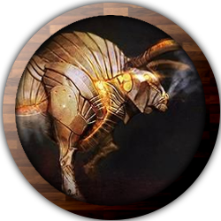

# Simon Evans

**Background:** Vault Dweller

**Class:** Artificer; Battle Smith (5)

**Multi Class:** Wizard; War Magic (5)

**Race:** Halfling, Lightfoot

**Alignment:** Chaotic Good

------------

**Size:** Small

**Speed:** 25ft.

**AC:** 15 ( Studded Leather Armor ), 17 ( Arcane Deflection ) , 20 ( Shield )

**HP:** 58

**Hit Dice:** 5d8, 5d6

**Initiative:** 8

**Proficiency Bonus:** 4

------------

|       | STR | DEX | CON | INT | WIS | CHA |
| ----- | --- | --- | --- | --- | --- | --- |
| Score |  10 |  16 |  13 |  20 |  14 |  12 |
| Mod   |  +0 |  +3 |  +1 |  +5 |  +2 |  +1 |
| Save  |  +0 |  +3 |  +5 |  +9 |  +2 |  +1 |

| Prof | Mod | Skill                  |
| ---- | --- | ---------------------- |
|      |  +3 | (DEX) Acrobatics       |
|      |  +2 | (WIS) Animal Handling  |
| Prof |  +9 | (INT) Arcana           |
|      |  +0 | (STR) Athletics        |
|      |  +1 | (CHA) Deception        |
| Prof |  +9 | (INT) History          |
|      |  +2 | (WIS) Insight          |
|      |  +1 | (CHA) Intimidation     |
|      |  +4 | (INT) Investigation    |
|      |  +2 | (WIS) Medicine         |
|      |  +4 | (INT) Nature           |
|      |  +2 | (WIS) Perception       |
|      |  +1 | (CHA) Performance      |
|      |  +1 | (CHA) Persuasion       |
|      |  +4 | (INT) Religion         |
| Prof |  +7 | (DEX) Sleight of Hand  |
|      |  +3 | (DEX) Stealth          |
| Prof |  +6 | (WIS) Survival         |

## Proficiencies, Languages, Senses

**Armor:** Light, Medium, Shields

**Tools:** Cook's Utensils, Glassblower's Tools, Land Vehicles, Smith's Tools, Thieves' Tools, Tinker's Tools

**Weapons:** Firearms, Simple, Martial

**Languages:** Common, Halfling

**Senses:** passive Perception 12

## Attacks

**Arcane Wrench.** Melee Weapon Attack: +9 to hit, reach 5 ft., one target. Hit: (2d6 + 5) magical bludgeoning damage.

**Repeating Musket.** Ranged Weapon Attack: +10 to hit, range 40/120 ft., one target. Hit: (1d12 + 6) magical piercing damage.

## Spellcasting

**Spellcasting Ability:** Intelligence

**Spell Attack Bonus:** 9

**Spell Save DC:** 17

- **Cantrips:** Dancing Lights, Mending, Frostbite, Lightning Lure, Mage Hand, Toll the Dead
- **1st (4):** Alarm, Cure Wounds, Detect Magic, Find Familiar, Floating Disk, Heroism, Identify, Magic Missile, Protection from Evil and Good, Shield, Sleep
- **2nd (3):** Branding Smite, Dragon's Breath, Heat Metal, Invisibility, Misty Step, Vortex Warp, Warding Bond
- **3rd (3):** Counterspell, Fly, Sending
- **4th (2):** Fabricate
- **5th (0):**
- **6th (0):**
- **7th (0):**
- **8th (0):**
- **9th (0):**

## Features

### Rustic Hospitality ( Vault Dweller )

Since you come from the ranks of the common folk, you fit in among them with ease. You can find a place to hide, rest, or recuperate among other commoners, unless you have shown yourself to be a danger to them. They will shield you from the law or anyone else searching for you, though they will not risk their lives for you.

### Lucky ( Halfling )

When you roll a 1 on the d20 for an attack roll, ability check, or saving throw, you can reroll the die and must use the new roll.

### Halfling Nimbleness ( Halfling )

You can move through the space of any creature that is of a size larger than yours.

### Brave ( Halfling )

You have advantage on saving throws against being frightened.

### Naturally Stealthy ( Halfling )

You can attempt to hide even when you are obscured only by a creature that is at least one size larger than you.

### Magical Tinkering ( Artificer )

At 1st level, you've learned how to invest a spark of magic into mundane objects. To use this ability, you must have thieves' tools or artisan's tools in hand. You then touch a Tiny nonmagical object as an action and give it one of the following magical properties of your choice:

- The object sheds bright light in a 5-foot radius and dim light for an additional 5 feet.
- Whenever tapped by a creature, the object emits a recorded message that can be heard up to 10 feet away. You utter the message when you bestow this property on the object, and the recording can be no more than 6 seconds long.
- The object continuously emits your choice of an odor or a nonverbal sound (wind, waves, chirping, or the like). The chosen phenomenon is perceivable up to 10 feet away.
- A static visual effect appears on one of the object's surfaces. This effect can be a picture, up to 25 words of text, lines and shapes, or a mixture of these elements, as you like.
The chosen property lasts indefinitely. As an action, you can touch the object and end the property early.

You can bestow magic on multiple objects, touching one object each time you use this feature, though a single object can only bear one property at a time. The maximum number of objects you can affect with this feature at one time is equal to your Intelligence modifier (minimum of one object). If you try to exceed your maximum, the oldest property immediately ends, and then the new property applies.

### Infuse Item ( Artificer )

At 2nd level, you've gained the ability to imbue mundane items with certain magical infusions, turning those objects into magic items.

When you gain this feature, pick four artificer infusions to learn. You learn additional infusions of your choice when you reach certain levels in this class, as shown in the Infusions Known column of the Artificer table.

Whenever you gain a level in this class, you can replace one of the artificer infusions you learned with a new one.

Whenever you finish a long rest, you can touch a nonmagical object and imbue it with one of your artificer infusions, turning it into a magic item. An infusion works on only certain kinds of objects, as specified in the infusion's description. If the item requires attunement, you can attune yourself to it the instant you infuse the item. If you decide to attune to the item later, you must do so using the normal process for attunement (see the attunement rules in the Dungeon Master's Guide).

Your infusion remains in an item indefinitely, but when you die, the infusion vanishes after a number of days equal to your Intelligence modifier (minimum of 1 day). The infusion also vanishes if you replace your knowledge of the infusion.

You can infuse more than one nonmagical object at the end of a long rest; the maximum number of objects appears in the Infused Items column of the Artificer table. You must touch each of the objects, and each of your infusions can be in only one object at a time. Moreover, no object can bear more than one of your infusions at a time. If you try to exceed your maximum number of infusions, the oldest infusion ends, and then the new infusion applies.

If an infusion ends on an item that contains other things, like a bag of holding, its contents harmlessly appear in and around its space.

### Enhanced Defense Infusion ( Artificer )

Item: A suit of armor or a shield

A creature gains a +1 bonus to Armor Class while wearing (armor) or wielding (shield) the infused item.

The bonus increases to +2 when you reach 10th level in this class.

### Enhanced Weapon Infusion ( Artificer ):

Item: A simple or martial weapon

This magic weapon grants a +1 bonus to attack and damage rolls made with it.

The bonus increases to +2 when you reach 10th level in this class.

### Repeating Shot Infusion ( Artificer )

Item: A simple or martial weapon with the ammunition property (requires attunement)

This magic weapon grants a + 1 bonus to attack and damage rolls made with it when it's used to make a ranged attack, and it ignores the loading property if it has it.

If you load no ammunition in the weapon, it produces its own, automatically creating one piece of magic ammunition when you make a ranged attack with it. The ammunition created by the weapon vanishes the instant after it hits or misses a target.

### Homunculus Servant Infusion ( Artificer )

Item: A gem or crystal worth at least 100 gp

You learn intricate methods for magically creating a special homunculus that serves you. The item you infuse serves as the creature's heart, around which the creature's body instantly forms.

You determine the homunculus's appearance. Some artificers prefer mechanical-looking birds, whereas some like winged vials or miniature, animate cauldrons.

The homunculus is friendly to you and your companions, and it obeys your commands. See this creature's game statistics in the Homunculus Servant stat block, which uses your proficiency bonus (PB) in several places.

In combat, the homunculus shares your initiative count, but it takes its turn immediately after yours. It can move and use its reaction on its own, but the only action it takes on its turn is the Dodge action, unless you take a bonus action on your turn to command it to take another action. That action can be one in its stat block or some other action. If you are incapacitated, the homunculus can take any action of its choice, not just Dodge.

The homunculus regains 2d6 hit points if the mending spell is cast on it. If you or the homunculus dies, it vanishes, leaving its heart in its space.

**Type:** Tiny Construct

**Armor Class:** 13 (natural armor)

**Hit Points:** 1 + your Intelligence modifier + your artificer level (the homunculus has a number of Hit Dice "d4s" equal to your artificer level)

**Speed:** 20 ft., fly 30 ft.

| STR    | DEX        | CON     | INT     | WIS     | CHA    |
| ------ | ---------- | ------- | ------- | ------- | ------ |
| 4 (-3) | 15 (+2)    | 12 (+1) | 10 (+0) | 10 (+0) | 7 (-2) |
| -3     | +2 plus PB | +1      | +0      | +0      | -2     |

**Skills:** Perception +0 plus PB x 2, Stealth +2 plus PB

**Damage Immunities:** poison

**Condition Immunities:** exhaustion, poisoned

**Senses:** darkvision 60 ft., passive Perception 10 + (PB x 2)

**Languages:** understands the languages you speak

**Challenge:** —

**Proficiency Bonus (PB):** equals your bonus

**Evasion.** If the homunculus is subjected to an effect that allows it to make a Dexterity saving throw to take only half damage, it instead takes no damage if it succeeds on the saving throw, and only half damage if it fails. It can't use this trait if it's incapacitated.

**Force Strike. ( Action )** Ranged Weapon Attack: your spell attack modifier to hit, range 30 ft., one target you can see. Hit: 1d4 + PB force damage.

**Channel Magic. ( Reaction )** The homunculus delivers a spell you cast that has a range of touch. The homunculus must be within 120 feet of you.

### Artificer Specialist ( Artificer )

At 3rd level, you choose the type of specialist you are. Your choice grants you features at 5th level and again at 9th and 15th level.

### The Right Tool for the Job ( Artificer )

At 3rd level, you've learned how to produce exactly the tool you need: with thieves' tools or artisan's tools in hand, you can magically create one set of artisan's tools in an unoccupied space within 5 feet of you. This creation requires 1 hour of uninterrupted work, which can coincide with a short or long rest. Though the product of magic, the tools are nonmagical, and they vanish when you use this feature again.

### Battle Smith Spells ( Artificer )

Starting at 3rd level, you always have certain spells prepared after you reach particular levels in this class, as shown in the Battle Smith Spells table. These spells count as artificer spells for you, but they don’t count against the number of artificer spells you prepare.

| Artificer Level | Battle Smith Spells               |
| --------------- | --------------------------------- |
| 3rd             | Heroism, Shield                   |
| 5th	            | Branding Smite, Warding Bond      |
| 9th	            | Aura of Vitality, Conjure Barrage |
| 13th            | Aura of Purity, Fire Shield       |
| 17th            | Banishing Smite, Mass Cure Wounds |

### Battle Ready ( Artificer )

When you reach 3rd level, your combat training and your experiments with magic have paid off in two ways:

You gain proficiency with martial weapons. When you attack with a magic weapon, you can use your Intelligence modifier, instead of Strength or Dexterity modifier, for the attack and damage rolls.

### Steel Defender ( Artificer )

By 3rd level, your tinkering has borne you a faithful companion, a steel defender. It's friendly to you and your companions, and it obeys your commands. See its game statistics in the Steel Defender stat block, which uses your proficiency bonus (PB) in several places. You determine the creature's appearance and whether it has two legs or four; your choice has no effect on its game statistics.

In combat, the defender shares your initiative count, but it takes its turn immediately after yours. It can move and use its reaction on its own, but the only action it takes on its turn is the Dodge action, unless you take a bonus action on your turn to command it to take another action. That action can be one in its stat block or some other action. If you are incapacitated, the defender can take any action of its choice, not just Dodge.

If the Mending spell is cast on it, it regains 2d6 hit points. If it has died within the last hour, you can use your smith's tools as an action to revive it, provided you are within 5 feet of it and you expend a spell slot of 1st level or higher. The steel defender returns to life after 1 minute with all its hit points restored.

At the end of a long rest, you can create a new steel defender if you have smith's tools with you. If you already have a defender from this feature, the first one immediately perishes. The defender also perishes if you die.

**Type:** Medium Construct

**Armor Class:** 15 (natural armor)

**Hit Points:** 2 + your Intelligence modifier + 5 times your artificer level (the defender has a number of Hit Dice [d8s] equal to your artificer level)

**Speed:** 40 ft.

| STR     | DEX        | CON        | INT    | WIS     | CHA    |
| ------- | ---------- | ---------- | ------ | ------- | ------ |
| 14 (+2) | 12 (+1)    | 14 (+2)    | 4 (-3) | 10 (+0) | 6 (-2) |
| +2      | +1 plus PB | +2 plus PB | -3     | +0      | -2     |

**Skills:** Athletics +2 plus PB, Perception +0 plus PB x 2

**Damage Immunities:** poison

**Condition Immunities:** charmed, exhaustion, poisoned

**Senses:** darkvision 60 ft., passive Perception 10 + (PB x 2)

**Languages:** understands the languages you speak

**Challenge:** —

**Proficiency Bonus (PB):** equals your bonus

**Vigilant.** The defender can't be surprised.

**Force-Empowered Rend ( Action ).** Melee Weapon Attack: your spell attack modifier to hit, reach 5 ft., one target you can see. Hit: 1d8 + PB force damage.

**Repair (3/Day) ( Action ).** The magical mechanisms inside the defender restore 2d8 + PB hit points to itself or to one construct or object within 5 feet of it.

**Deflect Attack ( Reaction ).** The defender imposes disadvantage on the attack roll of one creature it can see that is within 5 feet of it, provided the attack roll is against a creature other than the defender.

### Extra Attack ( Artificer )

Starting at 5th level, you can attack twice, rather than once, whenever you take the Attack action on your turn.

### Spellcasting ( Wizard )

Each time you gain a Wizard level, you can add two Wizard Spells of your choice to your Spellbook for free. Each of these Spells must be of a level for which you have Spell Slots, as shown on the Wizard table. On your Adventures, you might find other Spells that you can add to your Spellbook (see “Your Spellbook”).

You can cast a Wizard spell as a ritual if that spell has the ritual tag and you have the spell in your Spellbook. You don't need to have the spell prepared.

### Arcane Recovery ( Wizard )

You have learned to regain some of your magical energy by studying your Spellbook. Once per day when you finish a Short Rest, you can choose expended Spell Slots to recover. The Spell Slots can have a combined level that is equal to or less than half your Wizard level (rounded up), and none of the slots can be 6th level or higher.

For example, if you’re a 4th-level Wizard, you can recover up to two levels worth of Spell Slots. You can recover either a 2nd-level spell slot or two 1st-level Spell Slots.

### Arcane Tradition ( Wizard )

When you reach 2nd Level, you choose an Arcane Tradition, shaping your practice of magic through one of eight schools, such as Evocation. Your choice grants you features at 2nd Level and again at 6th, 10th, and 14th level.

### Arcane Deflection

At 2nd level, you have learned to weave your magic to fortify yourself against harm. When you are hit by an attack or you fail a saving throw, you can use your reaction to gain a +2 bonus to your AC against that attack or a +4 bonus to that saving throw.

When you use this feature, you can't cast spells other than cantrips until the end of your next turn.

### Tactical Wit ( Wizard )

Starting at 2nd level, your keen ability to assess tactical situations allows you to act quickly in battle. You can give yourself a bonus to your initiative rolls equal to your Intelligence modifier.

## Biography

### Personality Traits

- I am always chasing the next biggest problem to solve.
- I will go to almost any lengths to keep my friends from getting hurt.

### Bonds

- My Uncle wants me to be something I'm not, wishing that I would avoid the study of magic in favor of working in his repair shop. He fears I will blow myself up, like my parents did.
- Pie was was first familiar, a mechanical bull. He is my most loyal and silent companion.
- Buttons was my second familiar, a spectral dragon. He brings joy to all around him.
- Snowball was my last familiar, a white stoat. She is a proud and royal fey spirit that is my mentor in tactics and warfare.
- My familiars are my closest partners. As their creators, they are my responsibility to keep safe.
- Willow is the only friend I have that is my age. She drives me up a wall, but I would die for her.
- Tselana was a big sister to me. When I was struggling to figure myself out, she encouraged me to follow my own path and not chase after others. I begrudgingly accept her undead servants.

### Ideals

- Knowledge. There is nothing more important than the spread of truth and honest information.
- Curiosity. The Universe is full of fascinating things ready to be learned and understood.

### Flaws

- I tend to put the world's problems on my shoulders, often worsening the situation at hand.
- I have a near crippling fear of the undead.

### Description

**Age:** 16

**Eyes:** Blue

**Hair:** Brown

**Height:** 4'0"

**Pronouns:** He/Him/His

**Skin:** Pale

### Backstory

Simon grew up never knowing his parents, Mirabella and Rory Evans. They perished in an accident just after his birth, experimenting with new arcane methods to power various parts of the archive. Since then, his Uncle had been raising him and acting as his mentor at their family repair shop.

Simon worked with his Uncle as an apprentice, running odd jobs for the town. In secret, he poured over books about history, the arcane, and the outside world. He also secretly worked on small gadgets and constructs to keep him company in his workshop. All of this he did against the wishes of his Uncle, who only wished for Simon to live a normal and accident free life.

Simon attended high school at the archive, where he got his first taste of magic, taking Cantrips 101 with his friend Willow.

Since leaving the archive, Simon expanded on his knowledge of the arcane, weaving it with his aptitude for engineering, invention, and tactics.

## Inventory

- 2 Sets of Bone Pipes
- Studded Leather Armor
- Repeating Musket
- Raptor Claw Dagger
- Glassblowers Tools
- Thieves' Tools
- Tinkerer's Tools
- Cooks Utensils
- Carpenter's Tools
- Smith's Tools